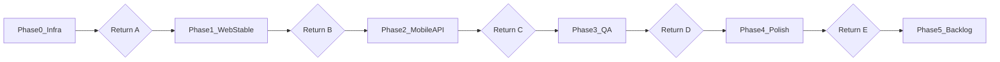
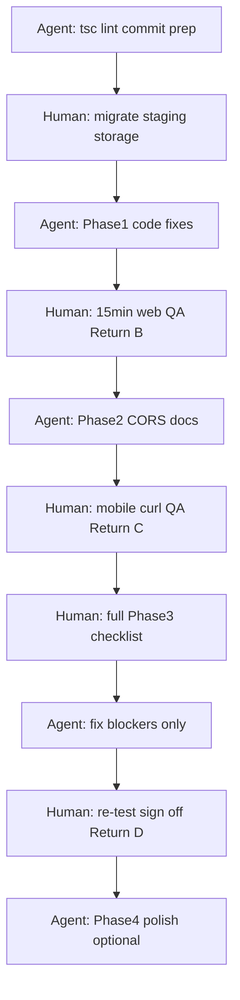

# Task Details Section — Release Plan

Release target: **web app + Expo/mobile REST clients** (desktop-first web UI).

Main code: [`app/components/task-details-panel.tsx`](../app/components/task-details-panel.tsx), [`app/components/detail-lines.ts`](../app/components/detail-lines.ts).

Each phase ends with a **point of return** — a defined stop where you can ship something concrete, or pause and resume later without losing progress.

---

## Overview

| Return | After phase | What you can ship |
|--------|-------------|-------------------|
| **A** | Phase 0 | Nothing user-facing — infra ready for development/staging |
| **B** | Phase 1 | **Web-only** details editor on desktop (same-origin, no mobile client) |
| **C** | Phase 2 | **Web + mobile** — full REST parity including images |
| **D** | Phase 3 | **Production candidate** — QA sign-off on staging |
| **E** | Phase 4 | **Polished production** — recommended public release |
| — | Phase 5 | Post-release improvements (optional, no fixed return) |

---

## Phase 0 — Infrastructure prerequisites

**Goal:** Environment can run the app with details, versions, and images without data loss.

### Steps

1. **Database**
   - Run `prisma migrate deploy` on staging/production (includes `TaskVersion` table: `20260819193000_add_task_versions`).
   - Confirm `DATABASE_URL` points to PostgreSQL.

2. **Image storage**
   - Ensure `uploads/tasks/` is on **persistent disk** (VM, container volume, etc.).
   - Do **not** deploy image uploads to ephemeral serverless unless you add object storage first.

3. **Commit current work**
   - Stage and commit in-flight details fixes (list formatting, heading selection, line controls, history tooltip).
   - Run `npx tsc --noEmit` and `npm run lint`.

4. **Smoke test on staging**
   - Open a task, edit title + body, wait for autosave, reload page, confirm persistence.

### Done when

- [ ] Migration applied successfully
- [ ] Images survive a server restart/redeploy
- [ ] `tsc` and `lint` pass
- [ ] One manual save/load cycle works on staging

### Point of return — **A**

| Shippable | Not included yet |
|-----------|------------------|
| Staging/dev environment ready | No production release |
| Team can continue Phases 1–4 | Mobile CORS, bug fixes, full QA |

**Stop here if:** You only needed infra setup. Resume at Phase 1 when ready to stabilize the editor.

---

## Phase 1 — Web stability and bug fixes

**Goal:** Desktop web details editor is reliable for daily use.

### Steps

1. **Verify formatting fixes** ([`detail-lines.ts`](../app/components/detail-lines.ts))
   - Partial selection → H1/H2/H3/Body: only selected text changes.
   - Multi-line selection → bullet/numbered/checklist: all lines in range convert correctly.
   - Toggle list type on selection removes list from selected lines only.

2. **Fix title loss on tab close** ([`task-details-panel.tsx`](../app/components/task-details-panel.tsx))
   - `pagehide` keepalive currently saves `details` only.
   - Extend to also persist title (`Task.name`) when it changed (PATCH or combined save).

3. **Re-test save flows**
   - Switch tasks mid-edit → previous task saved.
   - Network error → retry banner; no empty overwrite on reload.
   - Calendar modal close → `flushSave` runs.
   - 9 MB limit shows clear error.

4. **Verify line controls**
   - Plus icon: empty lines, hover only.
   - Drag icon: visible on clicked/focused body line.
   - Title line: no gutter controls.

### Done when

- [ ] All four formatting scenarios above pass manually
- [ ] Title survives tab close after rename
- [ ] Task switch + error paths tested once each

### Point of return — **B**

| Shippable | Not included yet |
|-----------|------------------|
| **Web app (desktop)** — full details editor for users on your deployed site | Expo/mobile image upload/view (CORS) |
| Autosave, versions, images (same-origin web) | Mobile API documentation |
| | Full QA checklist |
| | Polish pass (dark mode audit, dead code removal) |

**Stop here if:** You only need the web app internally or for desktop users. Mobile client should wait until Phase 2.

**Minimum web QA before Return B** (15–20 min):

- [ ] Create task, edit, autosave, reload
- [ ] Multi-line bullet list on selection
- [ ] Paste an image, reload, image still shows
- [ ] Open version history, restore a snapshot

---

## Phase 2 — Mobile / REST API parity

**Goal:** Expo (or any external client) can load, edit, and save details the same way the web app does.

### Steps

1. **Add CORS to image routes**
   - [`app/api/tasks/[taskId]/images/route.ts`](../app/api/tasks/[taskId]/images/route.ts) — `jsonWithCors`, `OPTIONS`.
   - [`app/api/task-images/[taskId]/[filename]/route.ts`](../app/api/task-images/[taskId]/[filename]/route.ts) — CORS headers on GET, `OPTIONS`.

2. **Document the details contract** — create [`docs/details-api.md`](details-api.md) (or section in README):
   - **Load:** `GET /api/tasks/{taskId}` → `name` + `details` (body HTML only).
   - **Save body:** `PUT /api/tasks/{taskId}/details` → `{ details: string }`.
   - **Save title:** `PATCH /api/tasks/{taskId}` → `{ name: string }`.
   - **Images:** `POST /api/tasks/{taskId}/images` (multipart), URLs in HTML as `/api/task-images/{taskId}/{filename}`.
   - **Versions:** `GET/POST /api/tasks/{taskId}/versions`, restore via `POST .../restore`.
   - **Editor HTML model:** first `.detail-line[data-line-type="h1"]` = title in unified editor; persisted split via `splitEditorContent` / `buildEditorHtmlFromTask`.

3. **Verify REST with curl or Expo dev client**
   - GET task → PUT details → PATCH name → POST image → GET image URL.

### Done when

- [ ] Image routes return CORS headers and answer OPTIONS
- [ ] `docs/details-api.md` exists and matches live routes
- [ ] Mobile client (or curl) completes full read/write/image cycle against staging

### Point of return — **C**

| Shippable | Not included yet |
|-----------|------------------|
| **Web + mobile** — REST clients can sync details, title, images, versions | Full manual QA (Phase 3) |
| Documented API contract for mobile team | Production sign-off |
| | UX polish, auth hardening |

**Stop here if:** Mobile app can integrate against staging API. Run Phase 3 before calling it production-ready.

**Minimum mobile QA before Return C** (30 min):

- [ ] GET task with details HTML
- [ ] PUT details, reload, content matches
- [ ] PATCH name, reload, title matches
- [ ] POST image, embed URL in HTML, GET image loads cross-origin
- [ ] List versions + restore one snapshot

---

## Phase 3 — Manual QA (release gate)

**Goal:** Sign off on staging with a fixed checklist. No new features — validation only.

### Checklist

#### Editor core
- [ ] Autosave (~2s) and reload persistence
- [ ] Task switch saves previous task
- [ ] Undo/redo in session
- [ ] Slash commands, add-block menu, drag reorder
- [ ] Click below last line

#### Formatting
- [ ] Inline styles (bold, color, fonts) on selection
- [ ] Headings on partial + multi-line selection
- [ ] Lists on multi-line selection
- [ ] Checklist toggle persists
- [ ] Links: create, edit, open, unlink

#### Images
- [ ] Paste, drop, delete, resize
- [ ] Rich paste + format prompt
- [ ] Orphan cleanup after delete

#### Header + history
- [ ] Due date/time/duration
- [ ] Mark complete
- [ ] Version history: auto, manual, preview, restore, Current badge

#### Save edge cases
- [ ] Offline → error + retry
- [ ] Tab close keepalive (details + title after Phase 1 fix)
- [ ] 9 MB error
- [ ] Calendar modal flush on close

#### Integration
- [ ] Search preview
- [ ] `/tasks/[taskId]` deep link
- [ ] Mobile REST checklist from Phase 2

### Done when

- [ ] Every checkbox above checked on staging
- [ ] No open **blocker** bugs (data loss, save failure, broken mobile sync)

### Point of return — **D**

| Shippable | Not included yet |
|-----------|------------------|
| **Production release candidate** — deploy to production with confidence | Optional polish (Phase 4) |
| Web + mobile details feature complete for v1 | Responsive mobile web layout |
| | Automated tests, offline queue |

**Stop here if:** You need to ship now. Phase 4 is optional before tag/release.

---

## Phase 4 — Release polish (optional before tag)

**Goal:** Small improvements that reduce support burden; none are blockers.

### Steps

1. **Dark mode** — spot-check editor, toolbar, offcanvas, links in [`globals.css`](../app/globals.css).
2. **Dead code** — remove unused [`detail-editor-toolbar.tsx`](../app/components/detail-editor-toolbar.tsx) or wire it (inline toolbar is canonical).
3. **Auth note** — document in `docs/details-api.md` that API routes use open CORS and assume private network or future auth layer.
4. **Known limitations for release notes**
   - Desktop-first layout (~700px min split pane).
   - Version preview is plain text, not rich HTML.
   - Repeat due date available in details panel and list row date picker.
   - Images via paste/drop only (no slash “insert image”).

### Done when

- [ ] Dark mode spot-check complete
- [ ] Release notes / limitations documented
- [ ] Auth assumption written down

### Point of return — **E**

| Shippable | Not included yet |
|-----------|------------------|
| **Recommended public v1 release** | Phase 5 backlog items |

**Stop here for v1.** Tag release, deploy production, monitor saves and image storage.

---

## Phase 5 — Post-release backlog

No point of return — pick items by priority after v1 is live.

| Priority | Item | Why later |
|----------|------|-----------|
| High | Object storage for images | Needed for serverless / scale |
| High | Automated tests (`detail-lines`, save, versions) | Prevent regressions |
| Medium | Responsive web (stacked details on narrow screens) | Desktop-first shipped in v1 |
| Medium | Rich HTML version preview | Plain text acceptable for v1 |
| Low | Offline edit queue | In-session pending state exists |
| Low | Labels/priority in details panel | Available in task list |
| Low | Insert image via slash menu | Paste/drop works |
| Low | Combined `PUT /details` with optional `name` | Two calls work today |

---

## Suggested timeline

| Phase | Effort | Cumulative |
|-------|--------|------------|
| 0 — Infra | 0.5 day | 0.5 day |
| 1 — Web stable | 1 day | 1.5 days |
| 2 — Mobile API | 1 day | 2.5 days |
| 3 — QA | 1 day | 3.5 days |
| 4 — Polish | 0.5 day | 4 days |

**Fastest path to production (Return D):** Phase 0 → 1 → 2 → 3.

**Fastest path to web-only (Return B):** Phase 0 → 1, then minimal web QA only.

---

## Agent execution strategy

Use **one agent session per phase** (or per return point). Each session should end at a checkpoint so you can verify before continuing.

### Principles

1. **Agent does code; you do infra and sign-off** — migrations, persistent disk, staging deploy, and final QA checkboxes need your environment/credentials.
2. **Never skip a return point** — run the phase’s “Done when” list before starting the next phase.
3. **Keep sessions focused** — paste the phase block from this doc as the agent prompt; avoid “do the whole plan in one go.”
4. **Fix forward** — if QA finds bugs in Phase 3, open a new agent session: “Phase 3 fix: [bug description]” rather than mixing with Phase 4 polish.

### Recommended session prompts

| Session | Paste this to the agent |
|---------|-------------------------|
| **0** | “Execute Phase 0 from docs/details-section-release-plan.md: run tsc/lint, list uncommitted details changes, confirm migration file exists. I will run migrate deploy on staging myself.” |
| **1** | “Execute Phase 1 from docs/details-section-release-plan.md: implement title keepalive on pagehide, verify list/heading formatting in detail-lines.ts, run tsc.” |
| **2** | “Execute Phase 2 from docs/details-section-release-plan.md: add CORS to image routes, create docs/details-api.md.” |
| **3** | “I completed Phase 3 QA and found: [list failures]. Fix blockers only, re-run tsc.” |
| **4** | “Execute Phase 4 from docs/details-section-release-plan.md: dark mode spot-fixes if needed, remove dead detail-editor-toolbar, add auth note to details-api.md.” |

### What the agent should not do alone

- Run production `prisma migrate deploy` without your confirmation
- Commit or push (unless you explicitly ask)
- Mark QA checkboxes as done (you verify in the browser)
- Configure hosting / object storage

### Parallel work (optional)

- **You:** Phase 0 staging deploy + smoke test  
- **Agent:** Phase 1 code in parallel  
- **Mobile dev:** Can start against staging after Phase 2 using `docs/details-api.md`

### Order of operations (agent + human)

---

## File reference

| Area | Files |
|------|-------|
| Editor UI | `app/components/task-details-panel.tsx` |
| Block model | `app/components/detail-lines.ts` |
| Links | `app/components/detail-links.ts` |
| Images | `app/components/detail-images.ts`, `lib/task-image-storage.ts` |
| Versions UI | `app/components/task-version-history-offcanvas.tsx` |
| Persistence | `lib/task-version-persistence.ts`, `lib/task-details-api.ts` |
| REST | `app/api/tasks/[taskId]/details/route.ts`, `app/api/tasks/[taskId]/versions/*` |
| Integration | `app/components/todo-app.tsx`, `app/components/calendar-task-modal.tsx` |
